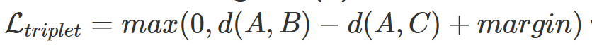
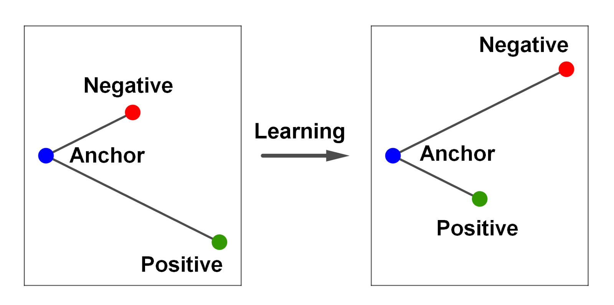
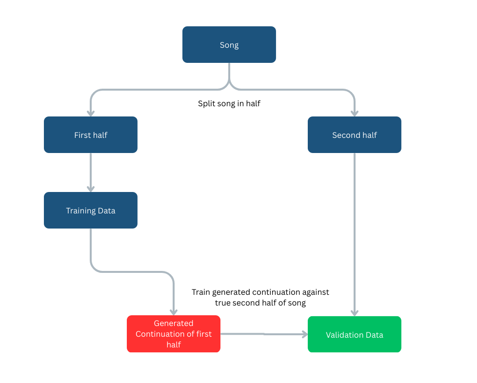
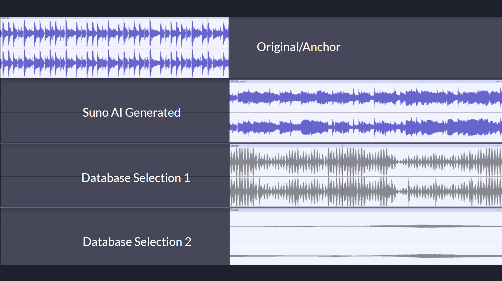

## Video

## Project Summary

This project focuses on creating a seamless music transition system that, given a library of music and a song, selects the best next song in the library to play after the current song ends, so it forms as seamless of a transition as possible

While the problem is straightforward and there are many successful examples of seamless music transitions available in different forms of media or music streaming services, it is far from a trivial task. 

Music is an incredibly high dimensional data. Each track carries with it a complicated blend of tempo, timbre, harmony, dynamic, and mood that evolves over time. Yet the way most electronic devices perceive music is through amplitude of different frequencies at different time frames, which is far from how humans understand it. So to achieve a seamless transition of music, the music data must be processed to a form that a computer can understand in a similar way as human ears. 

While humans can intuitively sense how music “flows” and what makes a great song transition, modeling such a sense on a computer is also very complicated. Smooth transitions between music are not governed by any one feature such as matching tempo or key, but a composite sense of flow that emerges through all the features of a track. There is no one universal algorithm that can make two songs compatible, as what might work in one context may not work in another. Furthermore, the perception of “smooth transition” is inherently subjective, which makes it difficult to define with algorithms or hard-coded logic.

Since there are no explicit rules that can describe what forms the perfect transition in every context, the problem cannot be solved through traditional algorithms. Which is why a system that can learn from data and behave differently based on the given input is crucial for this task. 

Artificial intelligence and machine learning allows systems to learn directly from example data, capturing patterns and relationships in music that are too intricate to traditionally encode. These models could process and “observe” how music flows in a similar way as humans, and develop an understanding of what forms a perfect transition. Allowing AI-based systems to learn musical flows and produce transitions that are musically coherent. 

Goal Example:
<video width="640" height="360" controls>
  <source src="./res/saveinsta.cc_720p-crazies-transition-between-songs-ever-metroboomin%20(online-video-cutter.com)(1).mp4" type="video/mp4">
  Your browser does not support the video tag.
</video>

## Approaches
### - Naive Approach

The naive approach is to utilize a one dimensional classification (such as genre, BPM, etc…) of each song, and select a song within the same group to choose as the next song. For example, if the current song was a “country” song, this approach would select another “country” song for a seamless transition. This is a very simple approach, and it would be extremely easy to implement and not require much training.

However, we realized very quickly that many songs who share the same one dimensional classification have vastly different beginnings/endings, and creating a seamless transition from this was virtually impossible.The accuracy and performance of this approach would be very low comparatively to other options.

### - BEATs Approach

BEATs is an audio classification model that processes audio into embeddings at each time-step of the song. The BEATs-Large model we utilized would perform very well at capturing different musical features such as rhythm, melody, harmony, tempo, and timbre. Using this model and the resulting embeddings, songs can be compared using each of their embeddings with a nearest neighbor algorithm to find the song with the most similar features.

This approach is relatively simple to implement, but also gives fairly accurate results in terms of how similar certain songs actually are. However, this approach is more focused on the song as a whole, instead of the specific starting and ending embeddings. Because of this, accuracy and performance are not fully optimized. Also, this approach requires a very large amount of data as the features of each song are represented across potentially hundreds of dimensions, which is further multiplied by the amount of embeddings in each song.

### - BEATS + LSTM approach

Instead of only using the BEATS classifications, we trained a Long Short-Term Memory (LSTM) model to forecast the continuation of input audio clips. We decided to use an LSTM model because of the importance of capturing key patterns and allowing past inputs to influence the current output.

Given a segment of a song, we split it into two parts. We feed the first part into the model and calculate the loss by comparing the model’s output with the second part of the file. This process compares the model’s predicted continuation to the actual continuation, giving us a loss function to optimize the model. 

The loss function is defined as a triplet of (anchor, positive, negative) clips. The anchor is the current embedding, while the positive clip is another embedding that is very similar to the anchor in the training data (for example, from the same song segment). The negative clip is an embedding that is not similar to the anchor. This triplet is used to further group together similar embeddings, and push away ones that are different.

Compared to the previous approaches, the LSTM model and triple loss function add a much higher accuracy to finding seamless transitions as this approach is much more optimized in finding similar songs and filtering songs that are different. However, it does suffer from the same issue as the previous approach as the data requirement is just as large (technically even larger).

### - Generative Prediction Approach

Further building on top of the BEATs + LSTM approach, we wanted to utilize generative AI to create and predict half of a song when given the first half. The AI would use the input to create the second half, which would be compared to the validation data (the real second half) to train and improve its performance. This process is shown by the diagram below:

Then, the generated clip would be processed by the BEATs + LSTM model, and compared with the first half of other songs to find the closest match. 

This approach would be the best representation of how seamless transition would work from a musical perspective. It would have the most accurate method of finding a transition as it specifically compares the first and second halves of songs, instead of song similarities as a whole. However, this method would take an extremely large amount of data and time to train - even more than the previous approaches. It may also result in a lot of error as it relies on the generative AI being able to generate accurate continuations of songs.

## Evaluation

**Note**: Due to School IT completely erasing all the data and code we have for this project, then setting up a storage limitation so we can no longer train a meaningful model, our project lacks a working product, therefore there is no quantitative evaluation data. So we can discuss what we would have done if complications mentioned above did not happen. 

### Quantitative:

#### - Triplet Loss Curve
The second stage of our project implements contrastive learning during training.To evaluate the effectiveness of contrastive learning, a triplet loss over time plot would be great for evaluation. We wish to see a smooth and consistent decrease in triplet loss, which means our model is increasingly capable at distinguishing between good and bad transitions. 

#### - Cosine Similarity Distribution
Cosine similarity is particularly effective for evaluating audio transitions. It captures the structural similarities between two audio clips and filters out other unimportant features such as loudness. In our model, songs are converted into high dimensional vectors by the BEATs model. By analyzing the cosine similarity between embeddings of the “transitioned-from” and the “transitioned-to” songs, we can assess how well the model understands the musical compatibility between songs. We hope to see a high similarity score for transitions for songs picked by our model. 

### Qualitative:
Given the nature of our project, qualitative evaluation mainly relies on human perceptions. Since musical transitions are inherently subjective, the most meaningful insights comes from listening to the transitions themselves and comparing them to other baseline outputs. By evaluating both the sound and the spectrograms of the transitions, we hope our model produces smoother, more musically coherent transitions than naive or random alternatives.

#### - Stage 1 Model transition

#### - Stage 3 Mock Demo

Due to the complications mentioned earlier, we were unable to use our own song-generation model. However, we still wanted to demonstrate the performance and limitations of our Stage 3 Generative Predictive AI approach.
To this end, we created a mock demo using Suno AI for song generation. In the demo, we input the “transitioned-from” song into Suno AI and asked it to extend the track. We then converted both the extended audio and our music database into array representations of their spectrograms. A cosine similarity search was conducted to identify the best-matching clip for a seamless transition.

Suno AI generated extension:

<audio controls>
  <source src="./res/Ai_generated_cont.wav" type="audio/wav">
</audio>

#### - Stage 3 Mock Demo Transition 1
<audio controls>
  <source src="./res/not_as_bad.wav" type="audio/wav">
</audio>

In this transition, the shift between clips wasn’t abrupt, but it also didn’t feel musically cohesive. The selected "transitioned-to" clip failed to preserve the mood of the original song. 	
However, when we examined the spectrogram, we observed that some key audio characteristics were retained — specifically, the bass drum rhythm. This suggests that while the spectrogram-based cosine similarity preserved structural elements, it fell short in capturing musicality and emotional tone.
We believe this issue arises from the inherent limitations of cosine similarity, which emphasizes structural resemblance in frequency space but ignores higher-level musical context. We expect that incorporating a BEATs pre-trained model — which is trained to capture both audio features and musical semantics — could better preserve musicality in future transitions.

#### - Stage 3 Mock Demo Transition 2
<audio controls>
  <source src="./res/kinda_bad.wav" type="audio/wav">
</audio>

In this case, the model transitioned into a section that sounded like quiet white noise, despite a high cosine similarity score of 0.96. This was surprising at first, but on closer inspection, we found that the issue likely stems from cosine similarity’s insensitivity to amplitude.
If we closely examine the spectrogram, we can detect subtle similarities between the clips. However, because cosine similarity treats all vectors as unit vectors, volume (magnitude) is discarded in the calculation. As a result, from a human listener’s perspective, the transition felt weak and contextually inappropriate — again underscoring the limitation of cosine similarity for capturing meaningful musical transitions.
  

## References

## AI Tool Usage