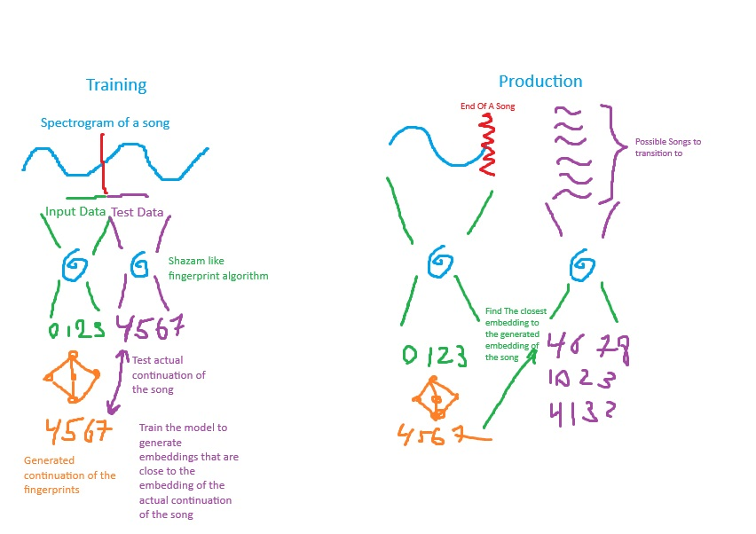

## Project Summary

<!-- A short paragraph outlining the main idea of the project (see further
instructions here: https://royf.org/crs/CS175/W25/proposal.pdf). You now have
a better sense of what your project is about than you did in the proposal, so update and clarify
beyond that version. Do not change your proposal page! (A few of you have already changed
it to reflect a change of topic, but don’t change it further, rather keep it as it was at the time
you locked down your topic). -->

This project focuses on creating a **seamless music transition model** that predicts the best next segment of a song based on learned embeddings. The goal is to generate **seamless transitions** between music clips without abrupt changes as if there was never a change in music.

The approach consists of three main components:

1. **Feature Extraction:** Using **BEATs Iteration 3** (a Transformer-based model for audio understanding) to extract **time-step embeddings** from songs.
2. **LSTM Training:** A **Bidirectional LSTM** trained with **contrastive triplet loss**, ensuring that the model learns to **smoothly transition between music segments**.
3. **Transition Matching:** Computing **cosine similarity** between embeddings to **predict the best transition point** between songs.

The dataset consists of **full-length songs** (from the **FMA dataset**), which are preprocessed by **segmenting them into 20-30 second clips** with **overlapping context** to preserve musical continuity. The final goal is to deploy this model for **automatic DJing, playlist blending, and AI-generated song transitions**.

## **Approach**
The goal is to create a seamless transition between two songs, as if they were part of the same piece. To create such a transition, we must identify a song whose beginning complements the ending of the previous song, making them sound unified.

### 1. Feature Extraction Using BEATs Iteration 3
Music data are highly complex and has a high-dimensional feature space, it includes multiple features such as timbre, tone, tempo, mood, key, progression scale, and etc...

In order to simplify the high-dimensional feature space and extract data that are easier to process, we used embedding to reduce the dimensionality while preserving the essential characteristics of the music.

We use **BEATs-Large (Iteration 3, AS2M model)** to extract **per-frame embeddings** from segmented audio clips. BEATs pre-trained model performs exceptionally well at capturing musical features such as rhythm, melody, harmony, and timbre. Which allow us to accurately captures the key characterstics of music data while lowering the complexity.

- Songs are **resampled to 16 kHz** and converted to **mono**.
- BEATs extracts embeddings at each **time-step (T × D format)**.
- **L2-normalization** is applied before passing embeddings to the LSTM.
- Data is stored in `.npy` format for fast retrieval.

We used the open FMA database which contains 106,574 untrimmed tracks with 161 unbalanced genres of music. Due to overwhelming data size, We plan to first train the model on a portion of the data then increase the data size as we proceed further into development process.

**Implementation Steps:**

- Songs are cut into **overlapping** 20-30 second segments (default: **25s clips, 5s overlap**).
- Segments are **named sequentially** to maintain their ordering.
- Embeddings are extracted and stored in **/NFS/dataset/embeddings/**.
- A **checkpointing system** ensures the process resumes from where it left off if interrupted.

### 2. Training the LSTM for Transition Prediction
To achieve a seamless transition, we need to determine what group of songs, when paired with the ending of the previous track, will blend seamlessly.

To address this challenge, we decided to train an AI model that predicts how a song will continue based on a given section. We adopted the Long Short-Term Memory (LSTM) model to train on music/audio data, enabling it to forecast the continuation of input audio clips.

LSTM was chosen because music is composed of notes and sequences, and to capture the musical flow, we need a model that recognizes patterns and allow past inputs to influence the current output.

Given a segment of song, we split it into two parts. We feed the first part into the model and calculate the loss by comparing the model's output with the second part of the file. This process compares the model's predicted continuation to the actual continuation, giving us a loss function to optimize the model.

We train a **Bidirectional LSTM** with **contrastive triplet loss** to predict the most seamless transition between song clips.

- **Two-Stage Embeddings**: The **end of one segment (A)** is matched with the **start of another segment (B)**.
- **Triplet Loss Objective:**
  $$
  \mathcal{L}_{triplet} = max(0, d(A,B) - d(A,C) + margin)
  $$
  where **(A, B, C)** is a triplet of (anchor, positive, negative) clips.
- **Exponential Weighting**:
  - The **last 3-5s** of segment A and the **first 3-5s** of segment B are given **higher weight** to prioritize smooth transitions.
- **Hyperparameters:**
  - **Hidden Units:** 128
  - **Layers:** 2-3
  - **Dropout:** 0.2
  - **Loss Margin:** 0.2-0.4
  - **Batch Size:** 32
  - **Optimizer:** Adam
  - **Learning Rate Schedule:** Cosine Annealing

Training is performed on **SLURM** using GPU nodes, with **checkpointing enabled** for preemption handling.

### 3. Transition Matching & Deployment

After training, the model will take a clip’s final embedding and produce the predicted continuing segment. Then the model will use FAISS(Facebook AI Similarity Search) to find the nearest neighbor of the predicted continuing segment in vector space. In this case, it will find the song that matches the most closely with the model predicted continuing segment. ONNX & PyTorch JIT are explored for fast inference deployment.

- The model takes a clip’s **final embedding** and finds the **best next segment**.
- **FAISS (Facebook AI Similarity Search)** is used for **efficient retrieval**.
- **ONNX & PyTorch JIT** are explored for **fast inference deployment**.

### 4. Evaluation Metrics
<!-- Might include 2 parts: how well the AI predict the continuation of the song and how well the actual transition worked -->

We evaluate **both perceptual and mathematical** similarity metrics:

- **Spectral Convergence & Mel-Spectrogram MSE**: Measures **audio continuity**.
- **Cosine Similarity & Triplet Loss**: Evaluates **embedding consistency**.
- **User Listening Tests**: Collect subjective ratings of transition quality.

<!-- Give a detailed description of your approach, in a few of paragraphs (at least a
couple). You should summarize the main algorithm you are using, such as by writing out how
it samples data and the equations of the loss(es) it optimizes (you can copy this information
from scientific publications or online resources, in which case cite them clearly. The default
GitHub Pages we shared includes an example of redering math within Markdown). You
should also give details about the approach as it applies to your scenario, such as how you set
up inputs and outputs (e.g. states / observations, actions, and rewards), how much data you
use (e.g. for how many interaction steps you train), and the values of any hyperparameters
(cite your source for default hyperparameter values, and for any changed values detail if and
how you tune them and the numbers you end up using). A good guideline is to incorporate
sufficient details so that most of your approach is reproducible by a reader. You're encouraged
to use figures for this, as appropriate, e.g. as we used in the exercises. -->

## **Evaluation**

<!-- An important aspect of your project, as we mentioned in the beginning, is
evaluating your project. Be clear and precise about describing the evaluation setup, for both
quantitative and qualitative results. Present the results to convince the reader that you have a
working implementation. Use plots, charts, tables, screenshots, figures, etc. as appropriate.
For each type of evaluation that you perform, you'll probably need at least 1 or 2 paragraphs
(excluding figures etc.) to describe it. -->

There has been a change in evaluation method from the proposal. We originally meant to use different features of the music such as tempo, mood, and progression as metrics for quantitative evaluation. However, as mentioned previously, we utilize the BEATs pre-trained model to embed the audio data, so we will be evaluating using the embedded data instead of the higher dimensional music features. 

We assess both **quantitative model accuracy** and **qualitative smoothness of music transitions** in following ways:

### Quantitative Evaluation

- **Triplet Loss Curve:** Monitor the triplet loss throughout the training process to show how the model performance as the training progresses. We wish to see a smooth decreasing curve with no erratic fluctuation which suggest the training is effective.
- **Cosine Similarity Distribution:** Analyze the distribution of cosine similarity scores between "correctly" paired song segments and "incorrectly" paired ones. We can evaluate how well the model is at recognizing good transitions and the bad transitions. A working model should show a clear separation, with higher similarity for "correct" transitions and lower similarity for "incorrect" transitions.
- **LSTM Loss Convergence:** Observe the loss curve for the LSTM-based model over successive training iterations to ensure it is steadily decreasing. If trained correctly, the model should show a consistent decrease in loss, indicating that it is effectively learning the pattern of a song and predicting the continuation based on past inputs.

### Evaluation

- **Random vs. Learned Transitions:** Evaluate the performance of our model by comparing model's predicted transition against **randomly shuffled segments** which serves as our baseline. We hope the model will at least out-perform randomly chosen clips to prove that our model do provide a practical improvement when picking songs to transition to. 
- **Spectrogram Alignment:**  Assess the continuity of transitions in the frequency domain by comparing spectrograms or Fourier-Transforms before and after the predicted transition point. We want our model's to generate a transition that maintains the previous song's musical characteristics, ensuring there is no abrupt changes in timbre, energy, and etc... 
- **Listening Study:**  Conduct a user study where participants listen to transitions generated by the model and rate them based on how seamless or disjointed they sound. This evaluation method will provide the most realistic validation on our model's performance by asking humans to directly judge the musicality of the transition. 

All evaluations are **logged in Weights & Biases (W&B)** for experiment tracking.

## **Remaining Goals and Challenges**
<!-- In a few paragraphs, describe your goals for the remainder
of the quarter. At the very least, describe how you consider your prototype to be limited,
and what you want to add to make it a complete contribution. Note that if you think your
algorithm is working well enough, but have not performed sufficient evaluation to gain insight,
doing this should be a goal. Similarly, you may propose comparing with other algorithms
/ approaches / manually tailored solutions (when feasible) that you did not get a chance to
implement, but can enrich your discussion in the final report. Finally, given your experience
so far, describe some of the challenges you anticipate facing by the time your final report is
due, to what degree you expected to become obstacles, and what you might try in order to
overcome them. -->
This is only the base implementation of the project, it still left many things to be desired both in functional performance and usability. 

### Two-Stage Embedding (Separate Start & End)

- Optimize **embedding separation** for better **sequence learning**.

### Predicting Next Music Segment for Seamless Transitions

- Introduce a **diffusion model** for transition refinement.

### Optimizing Crossfade Durations to Find the Best Seamless Song Transition

- Fine-tune the **best fade-in/fade-out durations** for **seamless audio blending**.

### Interactive Interface

- Create a **demo UI** to **visualize transitions** and allow user feedback.

### Music App Integration

- Test deployment into **Spotify/YouTube DJ playlists** or **local audio mixing software**.

## **Resources Used**

<!-- Mention all the resources that you found useful in writing your implemen-
tation. This should include everything like code documentation, AI/ML libraries, source
code that you used, StackOverflow, etc. You do not have to be comprehensive, but it is
important to report the sources that are crucial to your project. One aspect that does need to
be comprehensive is a description of any use you made of AI tools. -->

### Research Papers & Code

- **BEATs Transformer Model** (Microsoft UniLM):
  - [GitHub](https://github.com/microsoft/unilm/tree/master/beats)
  - **Pre-trained Checkpoints**: BEATs Iteration 3 AS2M
- **Triplet Loss**:
  - Hoffer & Ailon (2015): “Deep Metric Learning Using Triplet Network”
  - [Faiss: Facebook AI Similarity Search](https://github.com/facebookresearch/faiss)
  - [Shazam Music Processing Fingerprinting and Recognition] (https://www.toptal.com/algorithms/shazam-it-music-processing-fingerprinting-and-recognition)

### Libraries & Tools

- **Torch + Torchaudio** (Feature extraction, LSTM training)
- **FAISS** (Fast similarity retrieval)
- **ONNX, PyTorch JIT** (Optimized inference)
- **SLURM + HPC Cluster** (Model training)
- **Weights & Biases (W&B)** (Experiment logging)

### Infrastructure

- **Dataset:** FMA (Full-Sized Songs)
- **Cluster:** **Nvidia A100 & V100 GPUs, 100Gb/s InfiniBand**